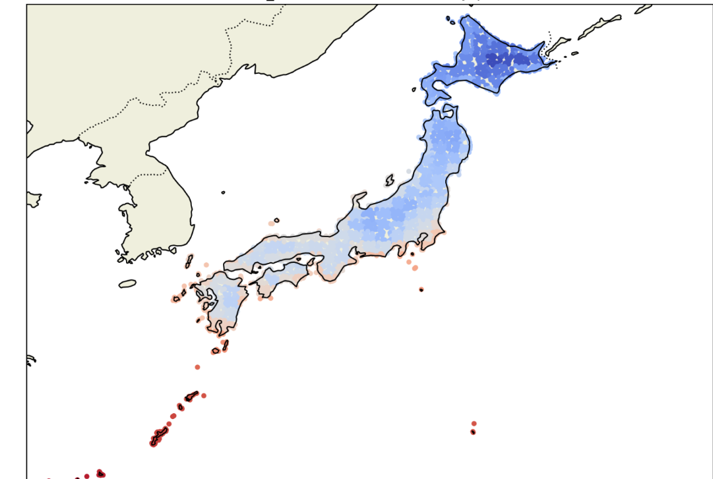
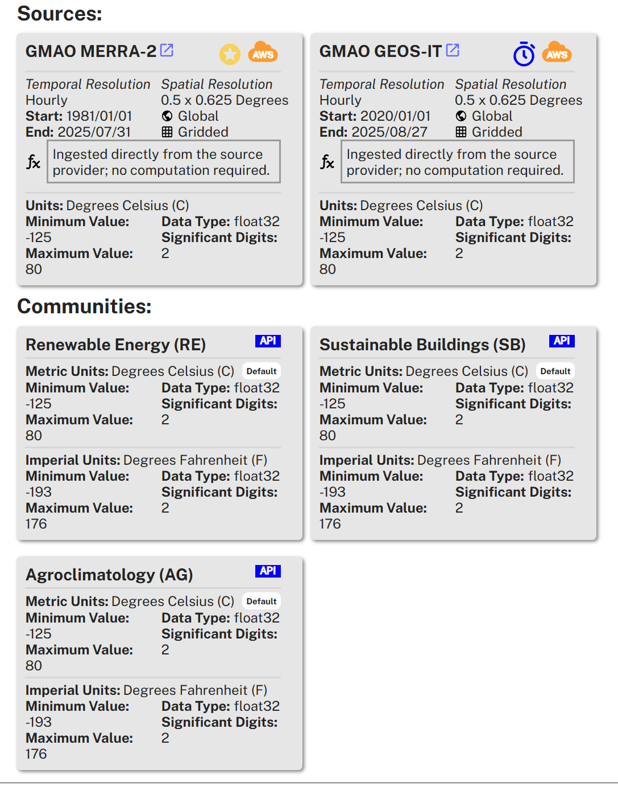
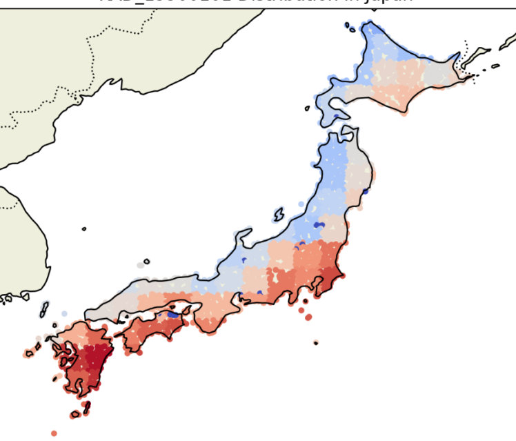
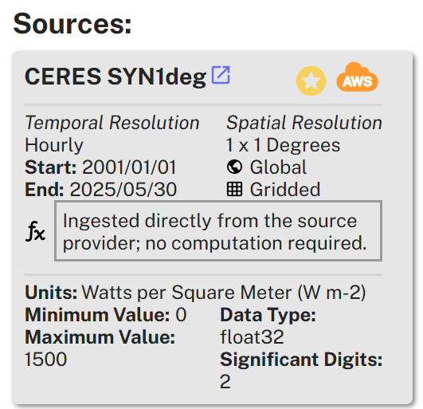
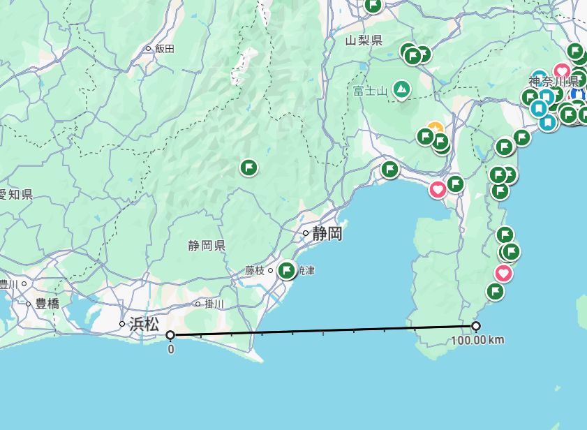

# NASA POWER API調査のメモ

下記の表示について空間分解能を調査する

## 温度の空間分解能

元データの分解能は0.5 * 0.625 degreesとなっていて、おそらく緯度と経度の分解能がそれぞれ0.5, 0.625度ということと思われる。

データで確認すると、計測値のプロットにおいて能登半島のしたの塊くらいの横幅が50kmであり、能登の横幅がおおむね20kmほどであることから元データ通りの分解能で表示されている

## 日射量の空間分解能

元データの分解能は1 * 1  degreesとなっていて、おそらく緯度と経度の分解能がそれぞれ1度ということと思われる。

データで確認すると、計測値のプロットにおいて静岡の伊豆半島の左端から浜松くらいまでが100km四方の塊になっている。1度は約111kmなのでこちらもおおむね合っている。

## 結論

結局もともとの分解能通りでプロットされているようだ。
